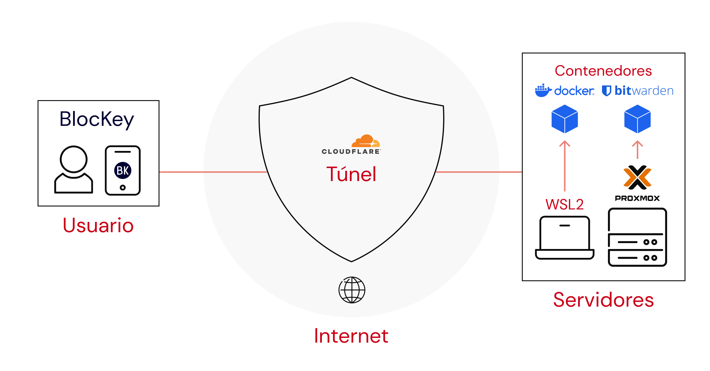
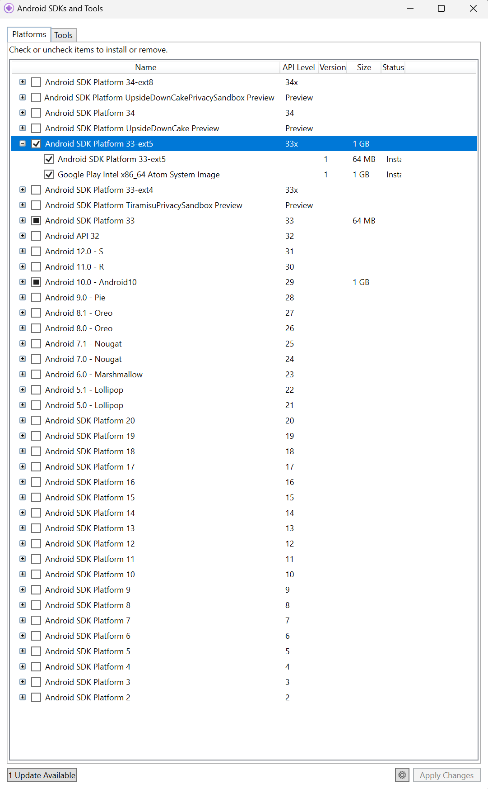

# BlocKey: gestor de contraseñas inclusivo basado en Bitwarden

## Tabla de contenidos

1. **[Autoría](#1-Autoría)**
2. **[Descripción del proyecto](#2-Descripción-del-proyecto)**
3. **[Diagrama de Arquitectura y Tecnologías](#3-Diagrama-de-Arquitectura-y-Tecnologías)**
4. **[Instrucciones de despliegue](#4-Instrucciones-de-despliegue)**
    1. **[Tecnologías](#41-Tecnologías)**
	2. **[Despliegue](#42-Despliegue)**
	3. **[Servidor](#43-Servidor)**
5. **[Contribuir](#5-Contribuir)**

---

## 1 Autoría


Escuela Técnica Superior de Ingeniería Informática

Doble Grado en Diseño y Desarrollo de Videojuegos + Ingeniería de Computadores

Curso 2023-2024

Trabajo de Fin de Grado de Diseño y Desarrollo de Videojuegos

**BLOCKEY: GESTOR DE CONTRASEÑAS INCLUSIVO BASADO EN BITWARDEN**

Autor: Alejandro Asensio Pérez

Tutor: Estefanía Martín Barroso

Cotutor: Isaac Lozano Osorio

## 2 Descripción del proyecto

BlocKey es un gestor de contraseñas diseñado especialmente para usuarios mayores o con necesidades especiales que enfrentan dificultades con las soluciones convencionales.
Basado en el ampliamente utilizado **[Bitwarden](https://github.com/bitwarden/mobile)**, BlocKey ha sido objeto de diversas mejoras y ajustes personalizados respaldados por rigurosas pruebas, con el objetivo de proporcionar una experiencia segura y accesible para un público diverso y global.

## 3 Diagrama de Arquitectura y Tecnologías

Los usuarios acceden a los servidores de la aplicación a través de un túnel de Cloudflare.
Este túnel de cero confianza, es un canal seguro para el envío de información en redes inseguras, como es Internet.

Los servidores emplean la virtualización de WSL2 (Hyper-V) o Proxmox, tecnologías que aprovechan mejor los recursos físicos de las máquinas para crear servicios.



Estos servicios, están desplegados en los servidores como contenedores Docker.
Un contenedor es una unidad o entorno que empaqueta el código y dependencias de una aplicación, y puede ejecutarse rápida y confiablemente, independientemente del hardware.
Las ventajas de los contenedores es que son un estándar en la industria, ligeros en términos computacionales (rendimiento eficiente y de bajo coste económico) y seguros por su aislación e independencia del sistema.


El servidor Bitwarden es una aplicación distribuida, que son un conjunto de componentes (contenedores) que parecen una aplicación coherente.
Es decir, el servidor está compuesto de servicios que colaboran entre sí. 

Se necesita desplegar un servidor Bitwarden porque algunos de los servicios del servidor atienden las necesidades de la aplicación móvil Bitwarden.
Además, al desplegarlo se adquiere control sobre el servidor, lo que otorga independencia al desarrollo de la aplicación.


Para el desarrollo de aplicaciones Android, se necesita un dispositivo físico para probar el código durante el mismo.
Sin embargo, por conveniencia se ha recurrido a la emulación.
Las herramientas de emulación son un software que imita la funcionalidad de otro sistema.

En el caso que acontece, el equipo de desarrollo contiene un procesador de arquitectura amd64, mientras que los dispositivos Android montan procesadores arm64 en la actualidad.
Por tanto, la máquina de desarrollo emplea un emulador Android, encargado de traducir las instrucciones de un ordenador a otro, para simular diferentes dispositivos simultáneamente.

De este modo el desarrollo se agiliza, ya que todo el entorno de desarrollo está en la misma máquina y se pueden simular tantos dispositivos como se desee.

Un dispositivo virtual Android hace uso de un hipervisor de tipo 2 y de un traductor para mostrar gráficos, dentro del Sistema Operativo (OS por sus siglas en inglés) anfitrión.


## 4 Instrucciones de despliegue

Para replicar el entorno de desarrollo del proyecto, a continuación se listarán las tecnologías y pasos a seguir.

### 4.1 Tecnologías

Primero hay que descargar el proyecto de Bitwarden a través del siguiente **[enlace](https://github.com/bitwarden/mobile/archive/refs/tags/v2023.9.2.zip)**.

Siguiendo las recomendaciones de la documentación de contribución de Bitwarden, hay que instalar un entorno de desarrollo integrado (IDE por sus siglas en inglés) para desarrollo Android, y .NET, que es una plataforma de desarrollo creada por Microsoft que fusiona un catálogo de productos software.
La arquitectura .NET es una librería que incluye los lenguajes de programación C# y XAML para la plataforma móvil de código abierto Xamarin. 

El OS empleado ha sido Windows 11 en su edición Pro, que incluye el hipervisor bare metal Hyper-V, para virtualizar y emular máquinas, y permite la instalación del IDE Visual Studio 2022 (VS2022).

| OS | Versión |
| ----------- | ----------- |
| Windows 11 Pro | 10.0.22621 x86_64 |

Aparte de .NET, el sistema de control de versiones Git es un programa que ha servido como plataforma para desarrollar y distribuir el proyecto durante el desarrollo en GitHub.

| Tecnología | Versión |
| ----------- | ----------- |
| .NET | 7.0.14 |
| Git | 2.42.0.windows.2 |

El IDE empleado fue VS2022, que mantiene en la actualidad retrocompatibilidad con Xamarin, que es una tecnología descontinuada.

| IDE | Versión |
| ----------- | ----------- |
| Visual Studio 2022 | Community 17.8.1 |
| Android | 10.0 |
| Xamarin.Android SDK | 13.2.2.0 |
| Android SDK Platform 29 | 5 |
| Google Play Intel x86_64 Atom System Image | 8 |
| Android SDK Platform 33 | 3 |
| Android SDK Platform 33-ext5 | 1 |

El primer componente imprescindible para VS2022 es “.NET Multi-platform App UI development” junto a la opción de Xamarin, que agregará las extensiones “Xamarin.Android SDK” y “Xamarin Templates”.


Desde las herramientas de Android, se puede instalar una versión.
En este caso, la versión 13 y 10 se utilizaron simultáneamente para garantizar la compatibilidad con dispositivos descontinuados y actuales a partes iguales.




Tanto el kit de desarrollo de software (SDK por sus siglas en inglés) como la dependencia OpenJDK de Android, se instalan automáticamente con ayuda del IDE.


La compilación del proyecto utiliza Android 13, que es más rápido y permite comprobar a posteriori la retrocompatibilidad de la aplicación resultante.
Además, la mínima versión de Android soportada es Android 5.0 “Lollipop” (2014), porque Xamarin no existía para versiones previas.


El dispositivo de emulación principalmente empleado en es un Pixel 3a con la Play Store, Android 10 y una pantalla de 2220 x 1080 píxeles.
Es una versión de Android descontinuada pero extendida, y tiene un ratio de aspecto de pantalla común en dispositivos actuales.


La aplicación móvil en VS2022 está compuesta de diferentes proyectos o ensamblados, contenidos en una misma solución.
Debido a que el desarrollo está centrado en Android, se han descartado los proyectos orientados a la versión de iOS.
A continuación, se muestran los paquetes, librerías o extensiones NuGet que utiliza cada proyecto, junto a la versión de instalación.

| Extensión NuGet | Proyecto | Versión |
| ----------- | ----------- | ----------- |
| Google.Apis.AndroidPublisher.v3 | store\google\Publisher | 1.64.0.3240 |
| Xamarin.GooglePlayServices.SafetyNet | src\Android\Android.csproj | 118.0.1.5 |
| Xamarin.Google.Dagger | src\Android\Android.csproj | 2.46.1.2 |
| Xamarin.Google.Android.Material | src\Android\Android.csproj | 1.9.0.2 |
| Xamarin.Firebase.Messaging | src\Android\Android.csproj | 123.1.2.2 |
| Xamarin.AndroidX.MediaRouter | src\Android\Android.csproj | 1.4.0.2 |
| Xamarin.AndroidX.Legacy.Support.V4 | src\Android\Android.csproj | 1.0.0.21 |
| Xamarin.AndroidX.Legacy.Support.Core.Utils | src\Android\Android.csproj | 1.0.0.21 |
| Xamarin.AndroidX.Legacy.Support.Core.UI | src\Android\Android.csproj | 1.0.0.22 |
| Xamarin.AndroidX.Core | src\Android\Android.csproj | 1.10.1.2 |
| Xamarin.AndroidX.CardView | src\Android\Android.csproj | 1.0.0.21 |
| Xamarin.AndroidX.AutoFill | src\Android\Android.csproj | 1.1.0.18 |
| Xamarin.AndroidX.AppCompat | src\Android\Android.csproj | 1.6.1.3 |
| Portable.BouncyCastle | src\Android\Android.csproj | 1.9.0 |
| Plugin.CurrentActivity | src\Android\Android.csproj | 2.1.0.4 |
| Microsoft.NET.StringTools | src\Android\Android.csproj | 17.8.3 |
| Xamarin.Essentials | src\Android\Android.csproj, src\App | 1.8.0 |
| MessagePack | src\Android\Android.csproj, src\App, src\Core | 2.5.129 |
| ZXing.Net.Mobile.Forms | src\App | 2.4.1 |
| ZXing.Net.Mobile | src\App | 2.4.1 |
| Xamarin.Forms | src\App | 5.0.0.2622 |
| Xamarin.FFImageLoading.Forms | src\App | 2.4.11.982 |
| Xamarin.CommunityToolkit | src\App | 2.0.6 |
| SkiaSharp.Views.Forms | src\App | 2.88.6 |
| Plugin.Fingerprint | src\App | 2.1.5 |
| zxcvbn-core | src\Core | 7.0.92 |
| PCLCrypto | src\Core | 2.0.147 |
| Newtonsoft.Json | src\Core | 13.0.3 |
| Microsoft.AppCenter.Crashes | src\Core | 5.0.3 |
| MessagePack.MSBuild.Tasks | src\Core | 2.5.129 |
| LiteDB | src\Core | 5.0.17 |
| CsvHelper | src\Core | 30.0.1 |
| xunit.runner.visualstudio | test\Common, test\Core.Test | 2.5.4 |
| xunit | test\Common, test\Core.Test | 2.6.2 |
| NSubstitute | test\Common, test\Core.Test | 5.1.0 |
| Microsoft.NET.Test.Sdk | test\Common, test\Core.Test | 17.8.0 |
| AutoFixture.Xunit2 | test\Common, test\Core.Test | 4.18.0 |
| AutoFixture.AutoNSubstitute | test\Common, test\Core.Test | 4.18.0 |

### 4.2 Despliegue

Para el despliegue de la aplicación, primero se debe archivar la solución.


Por último, hay que distribuir el archivo, o lo que es lo mismo, empaquetarlo y firmarlo.


Con todo, se ha generado la aplicación a partir de los pasos anteriormente descritos.

Todas las versiones de la aplicación están publicadas junto al binario BlocKey.(ver).Installer.arm.apk, por lo que se puede descargarse y usarse directamente la aplicación.

### 4.3 Servidor

La aplicación móvil necesita de una API REST, un servicio web que se basa en el protocolo http, como servicio para almacenar los elementos y usuarios de forma remota.

Bitwarden en su **[web](https://bitwarden.com/help/install-on-premise-manual/)** publica los requerimientos e instrucciones de despliegue de su servidor en Linux y Windows.

En este caso, las características de la máquina de desarrollo para el despliegue son las siguientes.

| OS | Versión |
| ----------- | ----------- |
| OpenSUSE Leap | 15.5 x86_64 |
| Host Hyper-V UEFI  | Release v4. |
| Kernel 5.14.21 | 150500.55.31-default |
| Package Management System | rpm y zypper |

Docker se empleó como tecnología de despliegue de contenedores, ya que es la primera recomendación de despliegue de Bitwarden.

| Tecnología | Versión |
| ----------- | ----------- |
| Docker | 24.0.5-ce |
| Docker Compose | 2.20.3 |

Con la máquina preparada, hay que ejecutar secuencialmente estos pasos.

#### 4.3.1 Buenas prácticas (opcional)

Crear un usuario dedicado al servicio, tal y como la **[documentación de docker](https://docs.docker.com/engine/install/linux-postinstall/)** recomienda para garantizar el principio de mínimo privilegio.
```
adduser bitwarden
passwd bitwarden
groupadd docker
usermod -aG docker bitwarden
mkdir /opt/bitwarden
chmod -R 700 /opt/bitwarden
chown -R bitwarden:bitwarden /opt/bitwarden
```

Instalar un firewall por software, y abrir los puertos http y https.
```
apt install ufw
ufw allow 8080
ufw allow 8443
systemctl restart ufw
```

#### 4.3.2 Instalación

Primero hay que descargar desde la API de Bitwarden el ejecutable y darle permisos de ejecución. Después, se lanza el ejecutable de instalación.
```
curl -Lso bitwarden.sh "https://func.bitwarden.com/api/dl/?app=self-host&platform=linux" && chmod 700 bitwarden.sh
~/home/bitwarden/bitwarden.sh install
```

Durante la instalación, hay que escoger las siguientes opciones. El *id* y la *key* se pueden obtener desde **[aquí](https://bitwarden.com/host/)**, mientras que la IP se debe corresponder con la de la máquina de desarrollo.
```
(!) domain name: 192.168.*.*
(!) free SSL: n
(!) id: XXX
(!) key: YYY
(!) region: EU
(!) SSL: n
(!) self-signed: y
```

Antes de iniciar el servidor, hay que cambiar las siguientes variables de entorno. *me@gmail.com* es el correo que envía los códigos de verificación, si se encuentra disponible por el proveedor de correo.
```
nano ~/home/bitwarden/data/env/global*
globalSettings__mail__replyToEmail=me@gmail.com
globalSettings__mail__smtp__host=smtp.gmail.com
globalSettings__mail__smtp__username=me@gmail.com
globalSettings__mail__smtp__password=password
adminSettings__admins=me@gmail.com
```

Por último, hay que reiniciar el servicio para aplicar los cambios.
```
./bitwarden.sh restart
```

El servidor se encuentra desplegado y listo para atender peticiones desde la IP de la máquina de desarrollo.

## 5 Contribuir

Si se desea continuar el desarrollo del presente proyecto, se puede clonar la última versión y continuar desde **[aquí](https://github.com/aaseper/blockey/releases/latest/)** el desarrollo.
Además, la última versión de desarrollo ya incluye todos los pasos del apartado **[4](#4-Instrucciones-de-despliegue)**.
